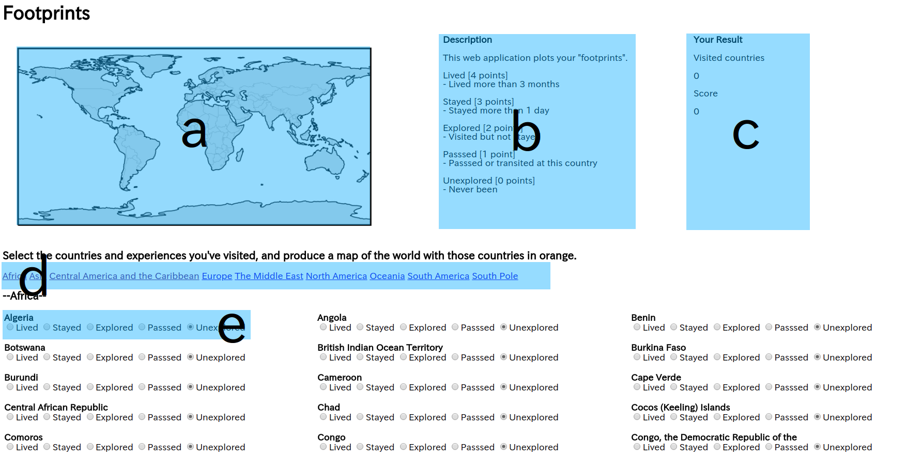

# Mini Project --Footprints--
2018 summer semisterに作成したWebアプリケーション

## Webアプリ概要
旅行が好きなため、訪問した国を記録、世界地図上に表示できるWebアプリを作成した。国をただ色塗るだけでは面白くないので、その国での経験も合わせて図示できるようにした。

使い方  

1.  タブ(b)をクリックし、地域を選択する
2.  登録したい国と経験をラジオボタン(e)により選択する  
経験は説明(b)を元に選択する
3.  選択後すぐに世界地図(a)、訪問国数(c)、経験スコア(c)が更新される。 
4.  スコア1-2は薄橙色、スコア3-4は橙色で表示される

内部処理
* Webアプリが立ち上がると初期化される
* 訪問国数と経験内容はJSON形式で保存している
* ラジオボタンが変更されると、イベントハンドラーによりJSONの更新と世界地図の更新が行われる
* ラジオボタンで選択された国とCartopyでプロットする国の対応付けは、国の2文字表記(ISO 3166-1 alpha-2)により行っている

## 工夫したところ
1. ラジオボタンが変更されると即時に世界地図、結果が更新されるようにした。
2. 結果をJSONに書き込んでおくことにより、変更されたラジオボタンだけの処理を行えばよく、画面更新までの時間を短くすることができた。
3. タブの形式を導入することによりページが縦に長くなることを防いだ。  
タブの作成は参考サイト1を元に作成した。
4. 国を地域ごとに分けることによりUXを向上させた。
5. すべての国のラジオボタンを作成する際、すべてベタ打ちは時間がかかったため、予め国名リストを用意し、Excel(html_template.xlsx)にてHTMLを作成した。  
国のリストは参考サイト2を元にした。  
Javascriptで作成する方法もチャレンジしたい。(→やりたりなかったこと)

## 今後の実装予定
* 出力結果(画像)のダウンロード機能  
画像をpngやsvg形式でダウンロードする機能を実装したい。
* 出力結果(訪問国リスト)のダウンロード機能
リストは現在JSON形式でサーバー内に保存しているため、これをダウンロードする機能を実装したい
* CSS等によるUI/UXの向上(特にラジオボタンの部分) 

* プロットする色の変更
カラーバーを用いてインタラクティブに色を変更できる機能を実装したい。
* すべての国のラジオボタンの作成を今回は直接HTMLを作成する形式で行ったが、Javascriptのfor文を使う形で作成したい。
* ユーザーログイン機能

## 参考サイト
1. ページ移動せずに内容を変更するタブ機能の作り方 https://allabout.co.jp/gm/gc/23969/1/
2. ISO 3166-1 https://ja.wikipedia.org/wiki/ISO_3166-1